### 合约说明
#### 1、整体架构
```
这是一个去中心化借贷协议，类似Aave的简化版本。包含两个主要功能：

存款借贷：用户存入USDC获得利息
抵押借贷：用户抵押其他代币借出USDC
```

#### 2、状态变量说明
##### 核心资金状态变量
```
// 资金总量
uint256 public totalBorrow;        // 总借贷量（USDC）
uint256 public totalLend;          // 总存款量（USDC）

// 利率相关
uint256 public utilizationRate;    // 资金利用率
uint256 public interestRate;       // 存款年化利率
```

##### 手续费相关
```
address public feeReceiver;        // 手续费接收地址
uint256 public feeReceiverAmount;  // 累计手续费金额

// 清算惩罚费率
uint256 public liquidationPenaltyFeeRate4Protocol;  // 平台收取费率
uint256 public liquidationPenaltyFeeRate4Cleaner;   // 清算人奖励费率
```

##### 代币地址配置
```
address public aaveTokenAddress;   // 平台代币地址
address public usdcTokenAddress;   // USDC代币地址  
address public chainlinkAddress;   // 价格预言机地址
address[] public supportedCollateralAddresses; // 支持的抵押代币列表
```

##### 用户存款映射
```
mapping(address => uint256) public userLendAmount;              // 用户存款金额
mapping(address => uint256) public userLendLastTime;           // 最后存款时间
mapping(address => uint256) public userLendLastTimeCalculateFee; // 最后计息时间
```

##### 用户借贷映射（按抵押代币分类）
```
// 借贷数据结构
mapping(address => address[]) public tokenBorrower; // 每个代币的借款人列表
mapping(address => mapping(address => uint256)) public userBorrowDepositedAmount; // 抵押数量
mapping(address => mapping(address => uint256)) public userBorrowAmount;         // 借贷金额(USDC)
mapping(address => mapping(address => uint256)) public userBorrowLastTime;       // 借贷时间
mapping(address => mapping(address => uint256)) public userBorrowLastTimeCalculateFee; // 最后计息时间
```

##### 抵押品配置结构体
```
struct Collateral {
    address tokenAddress;           // 代币地址
    uint256 utilizationRate;       // 利用率
    uint256 borrowed;              // 已借贷金额
    uint256 borrowable;            // 可借贷额度  
    uint256 healthFactor;          // 健康因子
    uint256 liquidationThreshold;  // 清算阈值
    uint256 collateralizationRatio; // 抵押率
}

mapping(address => Collateral) public collaterals; // 抵押代币配置
```

##### 常量定义
```
uint256 public constant TOKEN_DECIMALS;    // 代币精度(18位)
uint256 public constant RATE_DECIMALS;     // 利率精度(6位)  
uint256 public constant DOLLAR_DECIMALS;   // 美元精度(2位)
```

#### 3、函数详细流程
##### depositLend - 存入USDC获得利息

```
1、前置检查
    - 检查存入金额 > 0
    - 获取当前区块时间戳
2、利息计算与分配
    - 计算自上次计息的时间差计算出利息 > 0：
        - 使用复利公式计算应得利息：利息 = 本金 × (1 + 利率)^时间
        - 利息分配：平台收取部分 + 用户获得部分
        - 更新平台手续费约（利息的一部分）
        - 更新用户存款余额（利息部分）
        - 更新总存款池金额（利息部分）
        - 更新上次记息时间（当前时间）
3、存款处理
    - 增加用户存款金额（存入金额）
    - 增加总存款池金额（存入金额）
    - 记录当前时间为最后存款时间
    - 如果是首次存款，设置计息起始时间为当前时间
4、资金重算与转账
    - 重新计算各抵押代币的可借贷额度
    - 从用户钱包转移USDC到合约地址
5、触发状态更新事件
    - 触发存款变更事件（利用率、总存款金额、总借款金额、利息）
    - 触发各抵押品状态变更事件（利用率、存款金额、借款金额等）
```
##### depositLendWithdraw - 部分提取存款

```
1、验证阶段
    - 检查提取金额 > 0
    - 检查合约剩余流动性是否足够（总存款-总借贷）
    - 确保用户存款余额足够覆盖提取金额
2、利息计算与分配
    - 计算自上次计息的时间差计算出利息 > 0：
        - 使用复利公式计算应得利息：利息 = 本金 × (1 + 利率)^时间
        - 利息分配：平台收取部分 + 用户获得部分
        - 更新平台手续费约（利息的一部分）
        - 更新用户存款余额（利息部分）
        - 更新总存款池金额（利息部分）
        - 更新上次记息时间（当前时间）
3、提取操作
    - 减少用户存款金额（提取金额）
    - 减少总存款池金额（提取金额）
4、资金重算与转账
    - 重新计算各抵押代币的可借贷额度
    - 从合约向用户转账USDC
5、触发状态更新事件
    - 触发存款变更事件（利用率、总存款金额、总借款金额、利息）
    - 触发各抵押品状态变更事件（利用率、存款金额、借款金额等）
```

##### depositLendWithdrawAll - 全部提取存款

```
1、利息计算与分配
    - 计算自上次计息的时间差计算出利息 > 0：
        - 使用复利公式计算应得利息：利息 = 本金 × (1 + 利率)^时间
        - 利息分配：平台收取部分 + 用户获得部分
        - 更新平台手续费约（利息的一部分）
        - 更新用户存款余额（利息部分）
        - 更新总存款池金额（利息部分）
        - 更新上次记息时间（当前时间）
2、检查
    - 检查合约剩余流动性是否足够（总存款-总借贷），是否大于用户存款金额
3、提取操作
    - 设置用户存款金额为0
    - 减少总存款池金额（用户存款金额）
4、资金重算与转账
    - 重新计算各抵押代币的可借贷额度
    - 从合约向用户转账USDC
5、触发状态更新事件
    - 触发存款变更事件（利用率、总存款金额、总借款金额、利息）
    - 触发各抵押品状态变更事件（利用率、存款金额、借款金额等）
```

##### depositBorrow - 抵押借贷

```
1、抵押品验证
    - 检查抵押代币是否在支持列表中
    - 检查抵押金额 > 0
2、借贷额度计算
    - 通过Chainlink获取抵押代币和USDC的实时价格
    - 计算可借贷USDC金额：抵押数量 × 代币价格 × 抵押率 / USDC价格
3、利息费用计算
    - 如果是再次借贷，计算自上次的借贷利息
    - 平台收取部分利息作为手续费
    - 实际到账金额 = 可借金额 - 利息费用
    - 更新上次计息时间
4、检查
    - 检查该抵押代币的可借贷额度是否充足（可借贷金额 > 抵押品换成的usdc数量）
5、状态更新
    - 更新抵押代币的已借贷金额
    - 增加总借贷量
    - 记录用户借贷时间
    - 记录用户到该代币借贷用户数组中
6、资金交换
    - 用户抵押代币转入合约
    - 合约USDC转给用户（扣除利息后净额）
7、触发状态更新事件
    - 触发存款变更事件（利用率、总存款金额、总借款金额、利息）
    - 触发各抵押品状态变更事件（利用率、存款金额、借款金额等）
```

##### depositBorrowWithdraw - 还款赎回抵押品

```
1、抵押品验证
    - 检查抵押代币是否在支持列表中
    - 检查抵押金额 > 0
2、利息费用计算
    - 计算自上次的借贷利息
    - 平台收取部分利息作为手续费
    - 实际已借金额 = 上次已借金额 + 自上次计息以来的利息
    - 更新上次计息时间
3、检查
    - 检查该用户持有的usdc是否 >= 实际已借金额
4、状态更新
    - 减少抵押代币的已借贷金额(减少该用户实际已借金额)
    - 减少总借贷量(减少该用户实际已借金额)
    - 重置用户借贷时间=0
5、资金交换
    - 该用户将usdc还给平台
    - 平台将抵押代币还给该用户
6、触发状态更新事件
    - 触发存款变更事件（利用率、总存款金额、总借款金额、利息）
    - 触发各抵押品状态变更事件（利用率、存款金额、借款金额等）
```

##### checkLiquidate - 检查可清算账户

```
1、抵押品验证
    - 检查抵押代币是否在支持列表中
2、计算抵押品实际价值
    - 遍历抵押代币用户数组
        - 通过ChainLink查询抵押品价格能换算成多少usdc
        - 根据公式
            健康因子 = (抵押品价值 × 清算阈值) ÷ 债务价值
            其中：
            - 抵押品价值 = 抵押数量 × 抵押代币价格
            - 债务价值 = 借贷金额 × USDC价格
            - 清算阈值：由管理员设置的参数
            当健康因子 ≤ 1时，账户进入可清算状态
3、返回可清算账户列表
    - 通过第二步得到的用户地址
```

##### liquidate - 执行清算

```
1、利息费用计算
    - 计算自上次的借贷利息
    - 平台收取部分利息作为手续费
    - 实际已借金额 = 上次已借金额 + 自上次计息以来的利息
    - 更新上次计息时间
2、计算抵押品实际价值
    - 验证是否达到清算标准
        - 通过ChainLink查询抵押品价格能换算成多少usdc
        - 根据公式
            健康因子 = (抵押品价值 × 清算阈值) ÷ 债务价值
            其中：
            - 抵押品价值 = 抵押数量 × 抵押代币价格
            - 债务价值 = 借贷金额 × USDC价格
            - 清算阈值：由管理员设置的参数
            当健康因子 ≤ 1时，达到清算标准
3、清算操作
    - 清算奖励 = (清算金额 × USDC价格 × (1 + 清算人奖励率)) ÷ 抵押代币价格
        示例：
        - 清算人支付100 USDC
        - USDC价格：$1，抵押代币价格：$1.4
        - 清算人奖励率：5%
        - 获得奖励 = 100 × 1 × (1 + 0.05) ÷ 1.4 ≈ 75个抵押代币
4、资金转移
    - 清算人将usdc转给平台
    - 平台将对应的抵押代币和奖励转给清算人
5、状态更新
    - 更新被清算人的借款金额
    - 更新总借款金额
6、触发状态更新事件
    - 触发存款变更事件（利用率、总存款金额、总借款金额、利息）
    - 触发各抵押品状态变更事件（利用率、存款金额、借款金额等）
```

##### 4、核心业务逻辑特点
```
利息计算：采用复利计算，按时间天累计，不足一天不计算
风险控制：通过健康因子和清算机制管理风险
资金分配：可借贷额度平均分配给各抵押代币
价格依赖：依赖Chainlink价格预言机
升级能力：采用UUPS可升级合约模式
```

##### 5、核心event说明
###### StatusChanged 事件
```
触发时机：
    - 每个重要资金操作后
包含数据：
    - 资金利用率
    - 总借贷量
    - 总存款量
    - 当前利率
```

###### CollateralChanged 事件
```
触发时机：
    - 每个抵押品状态变更后
包含数据：
    - 抵押代币地址
    - 利用率
    - 已借贷金额
    - 可借贷额度
    - 利率
    - 健康因子
    - 清算阈值
    - 抵押率
```